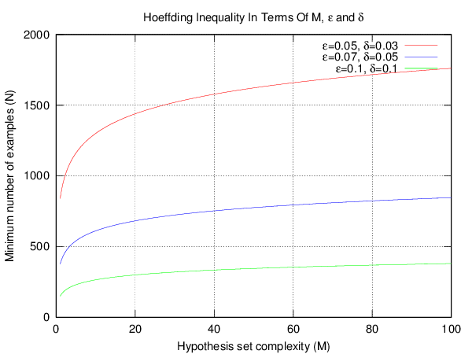

# Week #3

This homework was mostly about theoretical stuff, like probability bounds of
the Hoeffding Inequality, and the concepts of growth function/break point.

Don't expect a lot of code since all questions can be solved just by doing
some math or drawing things on a piece of paper.

## Plots

This plot shows the difference in the minimum number of examples ![N][N] when
varying the tolerance of deviation ![epsilon][epsilon] between ![Ein][Ein] and
![Eout][Eout], as well as the probability bound ![delta][delta].

[N]: http://latex.codecogs.com/gif.latex?N
[epsilon]: http://latex.codecogs.com/gif.latex?%5Cepsilon
[delta]: http://latex.codecogs.com/gif.latex?%5Cdelta
[Ein]: http://latex.codecogs.com/gif.latex?E_%7Bin%7D
[Eout]: http://latex.codecogs.com/gif.latex?E_%7Bout%7D
